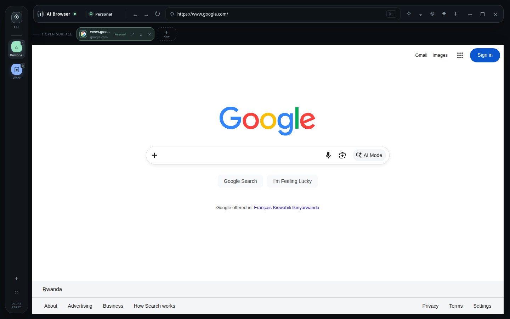
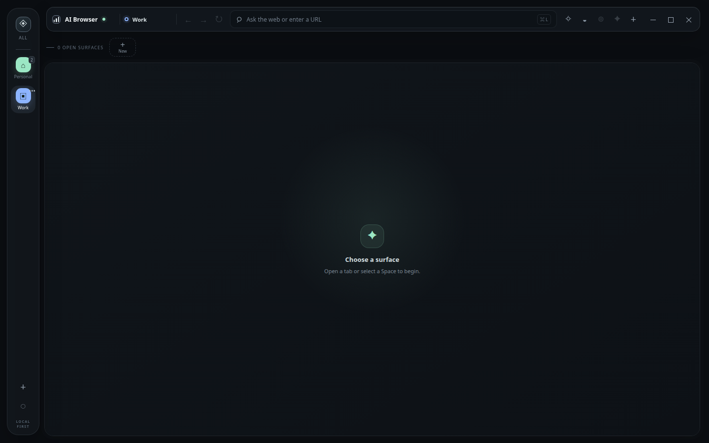

# AI Browser

AI Browser is a local-first Electron browser built around isolated browser identities called **Spaces**. It combines a familiar Chromium browsing surface with a custom workspace for tabs, bookmarks, site controls, a local credential vault, and an optional Codex-powered browser agent.



## Why it exists

Spaces keep browsing contexts separate. Personal, Work, and Private Spaces can have different tabs, cookies, local storage, permissions, credentials, and bookmarks. The browser remains useful as a normal browser even when the AI connection is unavailable.

## Features

- Frameless dark Electron browser shell with custom React chrome.
- Multiple tabs with global **All Spaces** and per-Space views.
- Persistent Personal and Work Spaces backed by isolated Chromium sessions.
- Ephemeral Private Spaces whose state is not written to disk.
- URL navigation and Google search from one command dock.
- Tab activation, cloning, moving, closing, and explicit hibernation.
- Space-scoped bookmarks and a Vault drawer.
- Site inspection, site-data clearing, and site forgetting controls.
- Main-process credential storage and explicit credential autofill.
- Optional local Codex app-server integration with streaming responses.
- Agent modes: Full, Guided, and Observe.
- Bounded browser-agent tools for page context, navigation, tabs, interaction, credentials, and screenshots.
- Local agent thread state and downscaled evidence thumbnails.
- Durable Goals with checkpointing, sleep/wake scheduling, compressed transcript archives, and agent memory search.



The screenshots were captured from a clean local Electron profile and show the current application UI without personal browsing or conversation data.

## Requirements

- Node.js and npm
- A graphical Linux, macOS, or Windows environment for Electron
- Optional: an installed and authenticated `codex` executable for Agent features

## Getting started

Install dependencies:

```bash
npm install
```

Run the production-style local build:

```bash
npm run build
npm start
```

Run development mode with Vite:

```bash
npm run dev
```

The development renderer is served at `http://127.0.0.1:5173`. The IPv4 loopback address is intentional.

## Verification

```bash
npm run typecheck
npm run build
npm test
git diff --check
```

The current automated suite covers state persistence and private-state filtering, agent policy, Codex protocol correlation, browser security classification, memory metrics, and Space/tab seeding. Full Electron end-to-end coverage is not yet included.

## Releases

GitHub Actions verifies the project on Linux, macOS, and Windows and produces x64 desktop packages
with electron-builder. Release Please maintains version bumps, release pull requests, tags, GitHub
Releases, and `CHANGELOG.md` from Conventional Commit titles.

Published releases contain Windows installer/portable executables, macOS DMG/ZIP packages, Linux
AppImage/Debian packages, SHA-256 checksums, an SPDX SBOM, and GitHub build-provenance attestations.
See [docs/RELEASING.md](docs/RELEASING.md) for the release process and signing-secret setup.

## AI agent setup

The Agent dock starts Codex lazily. The expected local process is:

```bash
codex app-server --stdio
```

Codex authentication must already be configured locally. AI Browser does not use an API-key fallback in this milestone, and it does not silently switch away from the configured default model (`gpt-5.6-luna`). If Codex is missing, unauthenticated, or cannot provide the requested model, ordinary browsing should continue while the Agent dock reports its connection state.

## Architecture

```text
Electron main process
├── BrowserRuntime       tabs, WebContentsViews, navigation, screenshots
├── SpaceSessionManager  persistent and private Chromium partitions
├── AppStateStore        browser metadata and atomic local persistence
├── SecretVault           encrypted credential summaries and main-process secrets
└── AgentRuntime          policy, threads, approvals, Codex, browser tools
        │ typed preload/IPC bridges
        ▼
React browser chrome
├── Space rail
├── command dock
├── tab deck
├── Vault and site drawers
└── Agent dock
```

Websites render in Electron `WebContentsView` instances rather than inside React or an iframe. The main process owns browser views, sessions, credentials, and policy decisions. The renderer receives typed snapshots and dispatches typed commands.

Important directories:

| Path | Purpose |
| --- | --- |
| `src/main/` | Electron runtime, browser views, sessions, IPC, state, and vault |
| `src/ai/` | Codex adapter, agent runtime, policy, evidence, and browser tools |
| `src/renderer/` | React browser chrome and visual system |
| `src/shared/` | Shared browser and agent contracts |
| `tests/` | Unit and protocol tests |
| `PROJECT_DOCUMENTATION.md` | Detailed implementation and security reference |

## Security and privacy boundaries

- Website content is treated as untrusted data and cannot change agent policy.
- The renderer cannot access Electron sessions or raw credential values.
- Passwords stay in the main process and are sent directly to the website preload only for an explicit fill operation.
- Agent access is constrained by Space, tab, origin, action class, Vault, private-state, and tab-count policy.
- Guided mode requires approval for actions classified as external effects or destructive.
- Private Spaces and private agent threads are excluded from disk persistence.
- Screenshots mask sensitive rectangles identified by the browser preload before evidence is retained.

## Current limitations

This repository is a working foundation. It does not yet include cloud sync, extensions, history, downloads management, shell/filesystem access, automatic tab hibernation, a full permissions UI, automatic updates, app-store publishing, or Electron end-to-end tests. Installer packages are automated, but trusted public distribution still requires the platform signing secrets described in the release guide. Site-data clearing and some Agent diagnostics remain partial; see `PROJECT_DOCUMENTATION.md` for the complete status and roadmap.

## License

No license file is currently included in the repository.
